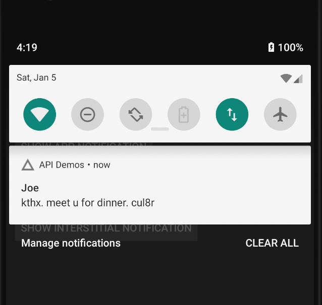

## Simple notification test with Appium, Python and Pytest fixture. 


#### Test code

https://github.com/mayukataoka/Appium-Python-Pytest-Demo/blob/master/test/test_android_notification.py

#### Command line test execution.
```
MAYUs-MacBook-Pro:Appium-Python-Pytest-Demo mayukataoka$ pytest test/test_android_notification.py 
========================================================================================================== test session starts ===========================================================================================================
platform darwin -- Python 3.7.1, pytest-4.0.2, py-1.7.0, pluggy-0.8.0
rootdir: /Users/mayukataoka/github/Appium-Python-Pytest-Demo, inifile:
collected 1 item                                                                                                                                                                                                                         

test/test_android_notification.py .                                                                                                                                                                                                [100%]

======================================================================================================= 1 passed in 12.52 seconds ========================================================================================================
M
```


#### Test steps

1. Open the screen with a button that triggers a notification. 

In stead of opening each screen one by one to reach the destination screen, directly open target activity.

```
            desired_capabilities={
                'app': ANDROID_APP_PATH,
                'platformName': 'Android',
                'automationName': 'UIAutomator2',
                'platformVersion': os.getenv('ANDROID_PLATFORM_VERSION') or '9',
                'deviceName': os.getenv('ANDROID_DEVICE_VERSION') or 'emulator-5554',
                'appActivity': self.INCOMING_MESSAGE_ACTIVITY
            }
```

or 

```
        driver.start_activity(self.PACKAGE, self.ACTIVITY)

```
2. Click on the button to trigger a notification
3. Open the notification screen. 

```
        driver.open_notifications()
```
4. Verify that the correct notification appeared. 
```
        notification_from_joe = driver.find_element_by_id('android:id/title')
        assert notification_from_joe.text == 'Joe'

```
